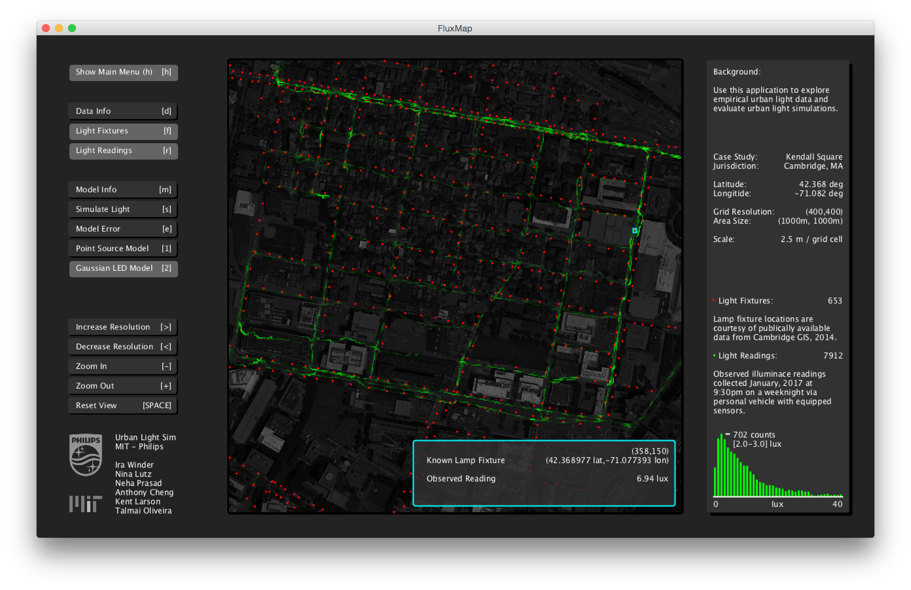

# FluxMap
Use this application to explore empirical urban light data and evaluate accuracy of urban light simulations.

# Features:
1. View Empirical Urban Lighting Data (i.e. lux values from a vehicle sensor)
2. View Empirical Urban Lighting Fixtures (i.e. light poles)
3. Simulate Lighting Data from Models of Lighting Fixtures
4. Compare Fit of Models to Observed Data

# Directions:
1. Download Processing (2.2.1) - https://processing.org/download/
2. Confirm Lastest Java is Installed https://java.com/en/download/mac_download.jsp
3. Clone The Repository
4. Run "FluxMap.pde" using Processing Application

# Data Viewer
 

# Model Viewer
 

