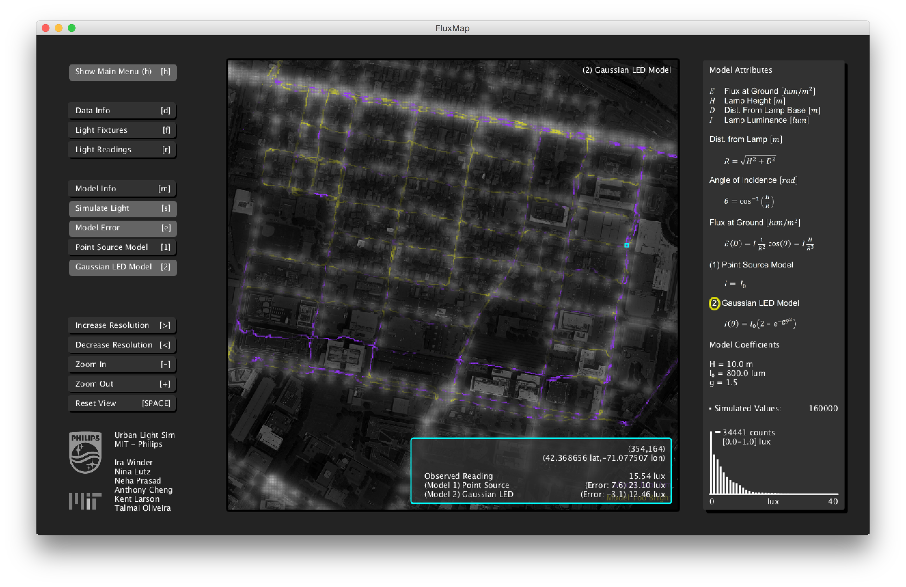

# FluxMap
Use this open source application to explore empirical urban light data and evaluate accuracy of urban light simulations.

## Features:
1. View Empirical Urban Lighting Data (i.e. lux values from a vehicle sensor)
2. View Empirical Urban Lighting Fixtures (i.e. light poles)
3. Simulate Lighting Data from Models of Lighting Fixtures
4. Compare Fit of Models to Observed Data

## Data Viewer
 

## Model Viewer
 

# Tactile Matrix
Insights from the project were implemented as an interactive simulation of pedestrian safety conditions at an intersection. This software requires a Tactile Matrix to operate.

## Features:
1. Place your own lighting fixtures at an intersection.
2. View Heatmaps of (a) lighting conditions and (b) simulated safety conditions.

## Interface
 

# Directions:
1. Download Processing (2.2.1) - https://processing.org/download/
2. Confirm Lastest Java is Installed https://java.com/en/download/mac_download.jsp
3. Clone The Repository
4. Run "FluxMap.pde" using Processing Application
4. Run "TactileMatrix.pde" using Processing Application (Tactile Matrix hardware recommended but not necessary)

# Sponsors
This research made possible by a generous grant from MIT and Philips Research.
